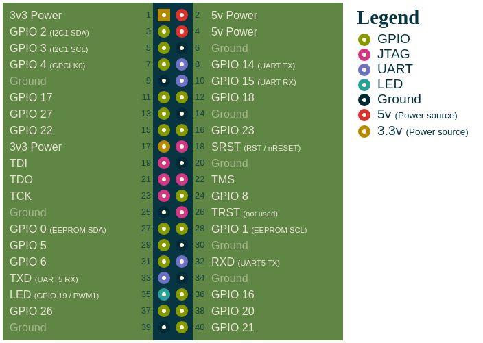

## Introduction

This is a special distribution of the Raspberry Pi OS for Raspberry
Pi 3, 4 or 400, which contains a complete development environment
for the Orange Cartridge.  Two example applications are also included.

The script `build.sh` creates the distribution using a Docker.  This
has been tested on 64-bit ARM only, other platforms may work but
are not supported.  Don't forget to fetch the `git submodule` first.

Alternatively, download a prebuilt image from the download area.


## Installation

To install, write `nnnn-nn-nn-Raspbian-64bit-ocdevenv.img` to an
SDcard of at least 16 MiB in size.  Insert the card in Raspberry Pi 3,
4 or 400, and power it up.  After completing the regular Raspbian
setup process, please reboot the system at least once in order for the
larger swap setting to kick in (important if the Pi has less than 4G of RAM).


## Building the sample applications

### super-reu

To build the super-reu, `cd` into the directory `super-reu`, and run
`make`.  The build should complete within a few minutes.  To flash
the built image, run `make flash`.  (Make sure the Orange Cartridge is
connected to USB, and is in bootloader mode.)

### RVCop64

To build the RISC-V coprocessor application, `cd` into `RVCop64/hw`
and run `./bitstream.py --platform orangecart`.  On a Raspberry Pi 3
this can take up to 15 minutes due to the constrained RAM in that model.
To flash the build image, run
`dfu-util -a 0 -D build/gateware/orangecart.bit -R`.  (Make sure the
Orange Cartridge is connected to USB, and is in bootloader mode.)


## 40-pin GPIO connector

The 40-pin GPIO connector on the Raspberry Pi can be used for some
extra functionality:

 * JTAG
 * Debug UART (if the bitstream programmed into the FPGA implements one)
 * Red/green LED (with cartridge breakout board only)

These are all optional functions, the USB cable is sufficient for
basic use.



The following table shows the appropriate connections to the "SWD" style
connector on the cartridge itself, to a 20-pin JTAG adapter such as
https://www.adafruit.com/product/2094, or to the 20-pin "3B" connector
on the cartridge breakout board.

| Signal | Pi 40-pin | SWD 10-pin | JTAG 20-pin | Breakout 20-pin | 
| ------ | --------- | ---------- | ----------- | --------------- |
| GND    | 20        | 3          | 4           | 4               | black
| TDI    | 19        | 8          | 5           | 5               | brown
| TMS    | 22        | 2          | 7           | 11              | red
| TCK    | 23        | 4          | 9           | 9               | yellow
| TDO    | 21        | 6          | 13          | 7               | green
| RST    | 18        | 10         | 15          | 3               | blue
| RXD    | 32        | -          | -           | 13              | purple
| TXD    | 33        | -          | -           | 15              | gray
| 3.3V   | 17        | -          | -           | 2               | orange
| LED    | 35        | -          | -           | 17              | white

3.3V need only to be connected to the breakout board for LED operation.
Do _not_ connect the Pi:s 3.3V to 3.3V/VCC/VREF in the JTAG connector.

Always connect GND, even if just using the serial port and/or LEDs.


### JTAG

OpenOCD has been set up to automatically connect to the ECP5 using
the JTAG interface on the 40-pin header.


### UART

On a Raspberry Pi 4 or 400, `/dev/ttyAMA1` is connected to UART5 on
pin 32 and 33. Note that RXD on the cartridge needs to be connected to
TX on the UART, and vice versa (zero modem).

Pi 3 does not have UART5 on pin 32/33.  Connect RXD/TXD elsewhere if needed.


### LEDs

To control the LEDs on the breakout board, first enable the GPIO
using

```
echo 19 > /sys/class/gpio/export
```

Then use the following commands:

```
echo low > /sys/class/gpio/gpio19/direction # Red
echo high > /sys/class/gpio/gpio19/direction # Green
echo in > /sys/class/gpio/gpio19/direction # Off
```
